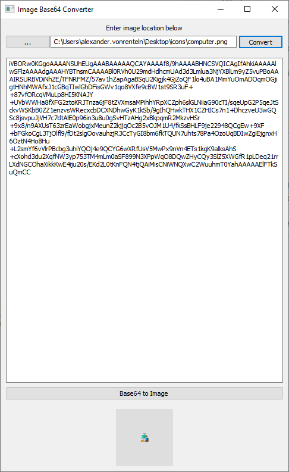

# base64-image-converter

Base64-Image-Converter is a Windows UI written in golang to convert images into base64 text.

Screenshot:




## Installation


```bash
go run .
```

## Usage

```bash
go build .
```

## Contributing
Pull requests are welcome. For major changes, please open an issue first to discuss what you would like to change.

Please make sure to update tests as appropriate.

## License
[MIT](https://choosealicense.com/licenses/mit/)
